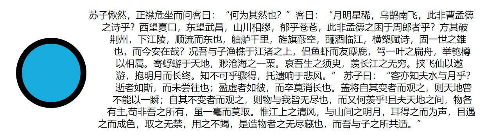
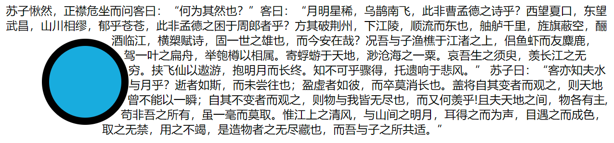
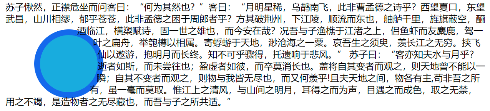
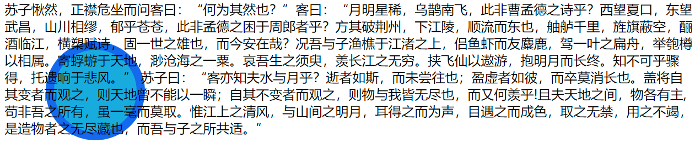
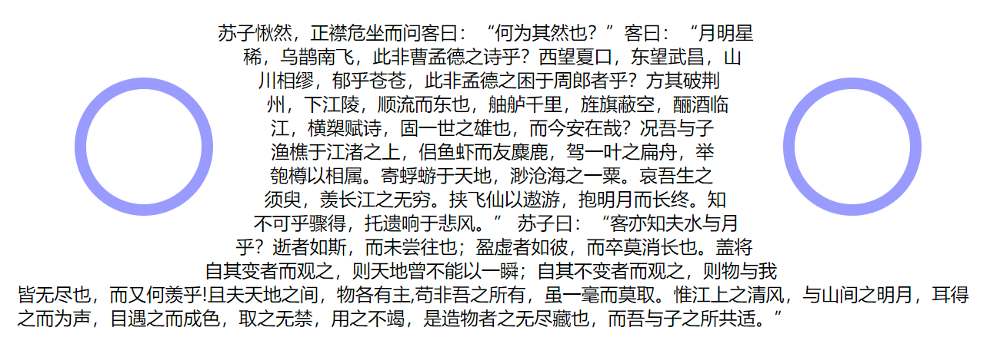

# shape

shape在MDN文档中属于指南系列，若你需要了解关于shape更详细的语法，请前往[MDN站点](https://developer.mozilla.org/zh-CN/docs/Web/CSS/CSS_shapes/Overview_of_shapes)阅读文档。

## 理解shape

这里我主要讲使用4个盒模型指定shape，这四个盒模型是:margin-box、padding-box、border-box、content-box。

注意，不要混淆了指定shape与盒模型，盒模型只有两种——标准盒模型与怪异盒模型。这样说吧，指定shape是用shape-outside:，而盒模型是用box-sizing:。

盒模型只有两种：

```css
/*怪异盒模型*/
*{
    box:border-box; 
}
/*标准盒模型*/
*{
    box-sizing:content-box;
}
```

再啰嗦一点，怪异盒模型与标准盒模型的最主要区别在于它们的大小。

怪异盒模型大小=width*heigth(content+margin+padding+border)

标准盒模型大小=width*height(content)+margin+padding+border


**然后是开始进入正题：shape。**

前面说到，我们可以基于盒子模型来定义某个盒子的shape，而这盒子模型有4个，这说明shape-outside这一原则**（基于盒子模型定义盒子shape）**下可以有这样4个值：margin-box、padding-box、border-box、content-box。

而这四个值，要是配合起**浮动**又可以起到不一样的效果，下面逐一介绍：

提醒读者需要注意的点是，下面例子，**所有的浮动盒子（原型）是没有设置width和height的**，这更有利于我们理解四种盒子的不同之处。读者在阅读下面例子之前也可以这样想，文字是如何**入侵浮动盒子**的！

1. shape-outside:margin-box;

   先看代码：

   

   ```html
   <!-- css -->
   <style>
           * {
               margin: 0;
               padding: 0;
           }
   
           body {
   
               width: 100vw;
               height: 100vh;
               position: relative;
           }
   
           .container {
               position: absolute;
               inset: 25%;
               padding: 10PX;
           }
   
           .ball {
               padding: 50px;
               margin: 50px;
               background: #16acde;
               float: left;
               border-radius: 50%;
               shape-outside:margin-box;
               border: 10px solid #000;
           }
       </style>
   <!-- html -->
    <div class="container">
           <div class="ball"></div>
           <div class="text">
               <p>苏子愀然，正襟危坐而问客曰：“何为其然也？”客曰：“月明星稀，乌鹊南飞，此非曹孟德之诗乎？西望夏口，东望武昌，山川相缪，郁乎苍苍，此非孟德之困于周郎者乎？方其破荆州，下江陵，顺流而东也，舳舻千里，旌旗蔽空，酾酒临江，横槊赋诗，固一世之雄也，而今安在哉？况吾与子渔樵于江渚之上，侣鱼虾而友麋鹿，驾一叶之扁舟，举匏樽以相属。寄蜉蝣于天地，渺沧海之一粟。哀吾生之须臾，羡长江之无穷。挟飞仙以遨游，抱明月而长终。知不可乎骤得，托遗响于悲风。”
               苏子曰：“客亦知夫水与月乎？逝者如斯，而未尝往也；盈虚者如彼，而卒莫消长也。盖将自其变者而观之，则天地曾不能以一瞬；自其不变者而观之，则物与我皆无尽也，而又何羡乎!且夫天地之间，物各有主,苟非吾之所有，虽一毫而莫取。惟江上之清风，与山间之明月，耳得之而为声，目遇之而成色，取之无禁，用之不竭，是造物者之无尽藏也，而吾与子之所共适。”
               </p>
           </div>
       </div>
   ```

   效果：

   

可以看见文字环绕左边圆形div的方式是沿着圆弧的，是“圆”的围绕，而不是原来的“方”的围绕。所以shape与float的配合有时候确实能给我们带来某些意想不到的效果。**当shape-outside为margin-box是，外边距是生效的，它把苏轼与朋友的对话挡在外边距之外！**

2. shape-ouside:border-box。

   只需要把上面的代码的小部分修改如下：

   ```html
   .ball {
               padding: 50px;
               margin: 50px;
               background: #16acde;
               float: left;
               border-radius: 50%;
               shape-outside:border-box;
               border: 10px solid #000;
           }
   ```

   效果：

   

文字依旧是“圆”的围绕，但是**当shape-outside为border-box时，外边距失效了，文字开始紧挨着圆形的边，此时苏轼与朋友的对话已经兵临城下！**

3. shape-outside:padding-box。

   只需要把上面的代码的小部分修改如下：

   ```html
   .ball {
               padding: 50px;
               margin: 50px;
               background: #16acde;
               float: left;
               border-radius: 50%;
               shape-outside:padding-box;
               border: 10px solid rgba(3,4,255,0.4);
           }
   ```

   效果：

   

文字依旧是“圆”的环绕，但是**当shape-outside为padding-box时，外边距和边框都不起作用了，苏轼和朋友的对话已经攻破城墙，杀到了它的内边距！**

注意这个例子的外边距被鹏佬改成了透明的蓝色，以帮助读者理解这道“城墙”的失效。

4.shape-outside:content-box。

只要把上面代码的小部分修改如下：

```html
.ball {
            padding: 50px;
            margin: 50px;
            background: #16acde;
            float: left;
            border-radius: 50%;
            shape-outside:content-box;
            border: 10px solid rgba(3,4,255,0.4);
        }
```

效果：



此时，圆所有的防御都失效了，苏轼和朋友的对话已经可以填充它的所有位置。至于为什么圆的位置不是左上角，那是因为圆的外边距依然存在，只是这个外边距，文字感受不到了！

## 应用shape

上面说明了我们可以使用4个不同的box值来指定盒子的shape，那么现在可以利用这些值来做一个小demo:

```html
<!-- css -->
<style>
        * {
            margin: 0;
            padding: 0;
        }

        body {

            width: 100vw;
            height: 100vh;
            position: relative;
        }

        .container {
            position: absolute;
            inset: 25%;
            padding: 10PX;
        }

        .ball-1 {
            padding: 50px;
            margin: 50px;
            float: left;
            border-radius: 50%;
            shape-outside:margin-box;
            border: 10px solid rgba(3,4,255,0.4);
        }
        .ball-2 {
            padding: 50px;
            margin: 50px;
            float: right;
            border-radius: 50%;
            shape-outside:margin-box;
            border: 10px solid rgba(3,4,255,0.4);
        }
    </style>
<!-- html -->
<div class="container">
        <div class="ball-1"></div>
        <div class="ball-2"></div>
        <div class="text">
            <p>苏子愀然，正襟危坐而问客曰：“何为其然也？”客曰：“月明星稀，乌鹊南飞，此非曹孟德之诗乎？西望夏口，东望武昌，山川相缪，郁乎苍苍，此非孟德之困于周郎者乎？方其破荆州，下江陵，顺流而东也，舳舻千里，旌旗蔽空，酾酒临江，横槊赋诗，固一世之雄也，而今安在哉？况吾与子渔樵于江渚之上，侣鱼虾而友麋鹿，驾一叶之扁舟，举匏樽以相属。寄蜉蝣于天地，渺沧海之一粟。哀吾生之须臾，羡长江之无穷。挟飞仙以遨游，抱明月而长终。知不可乎骤得，托遗响于悲风。”
            苏子曰：“客亦知夫水与月乎？逝者如斯，而未尝往也；盈虚者如彼，而卒莫消长也。盖将自其变者而观之，则天地曾不能以一瞬；自其不变者而观之，则物与我皆无尽也，而又何羡乎!且夫天地之间，物各有主,苟非吾之所有，虽一毫而莫取。惟江上之清风，与山间之明月，耳得之而为声，目遇之而成色，取之无禁，用之不竭，是造物者之无尽藏也，而吾与子之所共适。”
            </p>
        </div>
    </div>
```

效果：



简而言之，这种特性是控制文字排列形状的好帮手！上面的排列形状让我想到了广州塔，小蛮腰嘛！